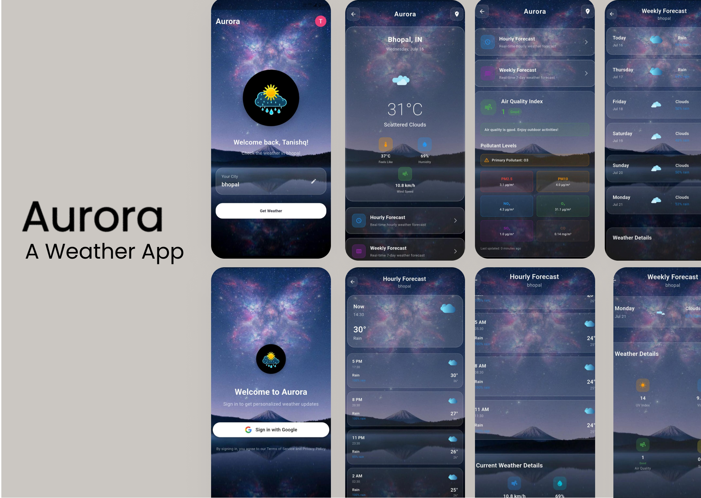

# 🌤️ Aurora – Weather App

> *Built with Flutter • Powered by Firebase • Designed for real-world forecasting.*

Welcome to **Aurora**, a sleek and modern weather application that delivers real-time weather insights, stylish animations, and an intuitive user experience — fully developed and designed by **Tanishq Shrivas**, a dedicated Flutter and mobile app enthusiast.

---
## 📱 App Preview

  

## 📲 Download the App

[⬇️ Download APK](https://drive.google.com/file/d/1m7j2Od8rT8NKGlnC8HxdrwqFECF1Y_zX/view?usp=sharing)

---

## ✨ Features

✅ **Live Weather Forecasts** – Accurate data based on your current location  
✅ **UV Index, Air Quality & Wind Speed** – All visualized neatly using FL Chart  
✅ **Hourly & Daily Forecasts** – Dynamically generated, beautifully displayed  
✅ **Sunrise & Sunset Information** – With animated transitions  
✅ **Firebase Authentication** – Google, Email, and Phone login options  
✅ **Lottie Animations** – Splash screens and weather effects come alive  
✅ **Material Theming** – Custom icons, clean design, responsive layout  
✅ **Offline Support & Connectivity Checks** – Smooth handling of no-network states

---

## 🛠️ Tech Stack

| Technology     | Purpose                              |
|----------------|---------------------------------------|
| Flutter        | Core framework                        |
| Dart           | Programming language                  |
| Firebase       | Authentication & backend services     |
| OpenWeatherMap | Weather & AQI data source             |
| FL Chart       | Graphs and visual data representation |
| Lottie         | Engaging UI animations                |
| GetX           | Navigation & reactive state handling  |
| SharedPrefs    | Store user preferences locally        |

---

## 👨‍💻 About the Developer

**Tanishq Shrivas**  
📍 Bhopal, Madhya Pradesh | 🎓 CSE @ IIIT Bhopal  
💼 Flutter Developer | 💡 UI/UX Enthusiast | 🚀 Aspiring Full-Stack Engineer  

📫 [LinkedIn](https://www.linkedin.com/in/tanishq-shrivas-815927324/) • [GitHub](https://github.com/tanishqshrivas) • [LeetCode](https://leetcode.com/u/tanishq003/)

---

## 🤝 Contributing

Got feedback? Found a bug or want to contribute a new feature?  
Open a pull request or raise an issue — let’s build **Aurora** together ☀️

---

## 📃 License

This project is licensed under the **MIT License** – you're free to use, modify, and enhance Aurora in your own way.

---

Thanks for exploring **Aurora** 🌈 – *Bringing Weather to Life.*
